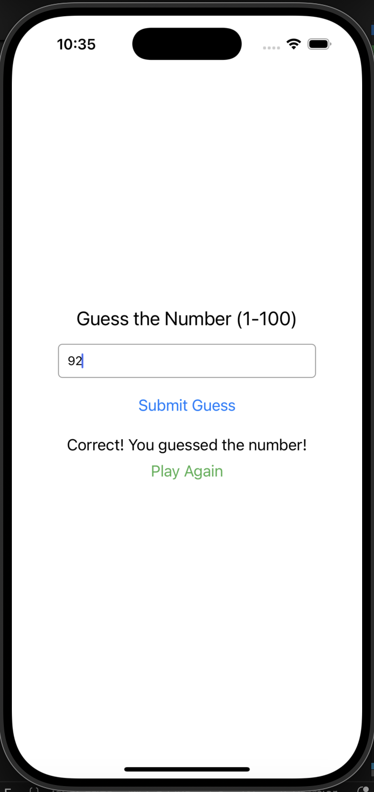

# 🎯 React Native Guessing Game

This is a simple number guessing game built with **React Native** and **Expo**. The user has to guess a randomly generated number between 1 and 100. After each guess, the app provides feedback: whether the guess is too low, too high, or correct.

---

## 🚀 Getting Started

These instructions will help you get a copy of the project up and running on your local machine for development and testing purposes.

### 📦 Prerequisites

- Node.js (https://nodejs.org/)
- Expo CLI (Install it using `npm install -g expo-cli`)
- Expo Go app on your mobile phone (iOS/Android)

---

## 📂 Installation

1. Clone the repository or create a new project:
   ```bash
   npx create-expo-app --template blank GuessingGame
   cd GuessingGame
   ```
2. Replace the contents of `App.js` with the provided game code (see below or `App.js` file).

3. Start the development server:

   ```bash
   npx expo start
   ```

4. Use your phone to scan the QR code in the terminal or browser using the **Expo Go** app.

## 📱 Features

- Text input for entering a guess
- Button to submit the guess
- Feedback if the guess is too high, too low, or correct
- Reset and play again feature

---

## 🧠 How It Works

- The app randomly generates a number between 1 and 100 when it starts.
- The user enters a number and submits it.
- The app compares the input and gives feedback:
  - **Too low**
  - **Too high**
  - **Correct**
- Once the number is guessed correctly, a “Play Again” button appears.

---

## 🛠 Built With

- [React Native](https://reactnative.dev/)
- [Expo](https://expo.dev/)

---

## 📸 Screenshots


